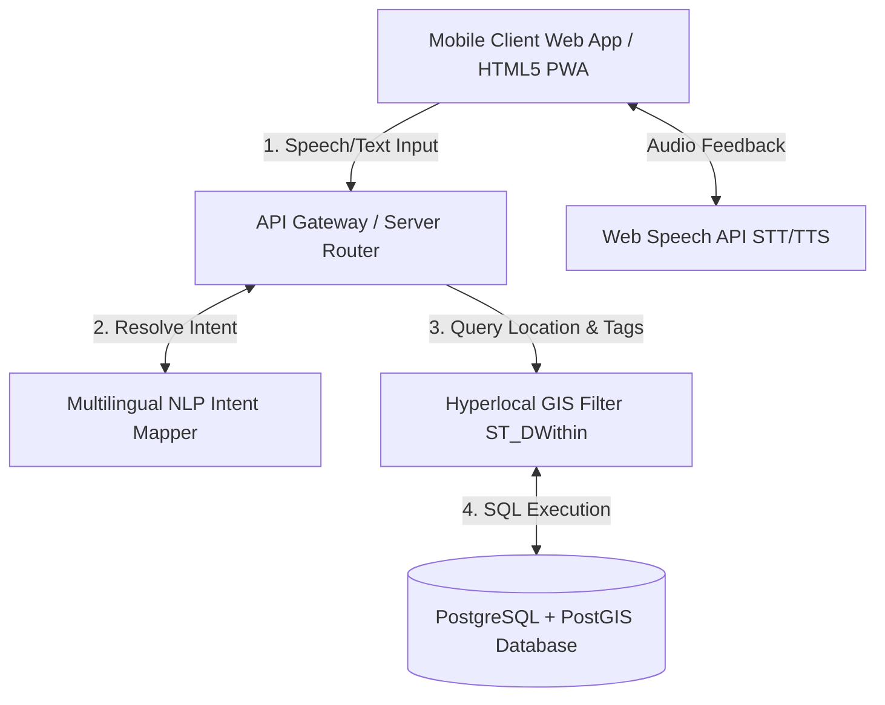

# AgriLabour Point - System Architecture

AgriLabour Point is designed as a lightweight, robust, hyper-local marketplace application tailored for rural agricultural areas. The architecture prioritizes minimal data transmission to function under poor rural network conditions (2G/3G/4G).

## 1. High-Level Component Layout

## 2. Technical Stack Configuration

### Frontend (Client Layer)
* **Core Technology:** HTML5, CSS3 Variables, Vanilla JavaScript.
* **Network Strategy:** Single Page App (SPA) design. All translation assets, icons, and diagrams are bundled on initial load, reducing round-trip requests.
* **Persistence:** `localStorage` is used to persist:
  * Language preference settings (`en`, `hi`, `mr`).
  * Authentication sessions.
  * Local listing snapshots.

### Backend (Logic Layer)
* **Runtime:** Node.js or Python (lightweight Flask/Express microservice).
* **Search Engine:** Language-aware index query translator mapping.
* **Voice NLP Service:** Integrates lightweight STT/TTS engines. For rural deployment, we leverage native browser Web Speech APIs to offload voice transcription workloads, saving network bandwidth.

### Database (Data Layer)
* **DBMS:** PostgreSQL.
* **GIS Extension:** PostGIS is utilized to compute coordinates and perform spatial indices (`idx_listings_geom` using GIST index) for filtering entries within a strict 10km search circle.

## 3. Low Rural Connectivity Optimizations

1. **Native Client-Side Processing:** Language translation dictionaries, navigation filters, and form validatons are entirely processed locally in Javascript, preventing server traffic.
2. **Minimal Payload size:** JSON schemas sent over HTTP contain compact properties, representing coordinates, skill strings, and prices without bloated descriptors.
3. **Optimized Spatial Queries:** Utilizing a bounding box filter via `ST_DWithin` in PostGIS prevents scanning the entire listings catalog, running search queries in milliseconds.
